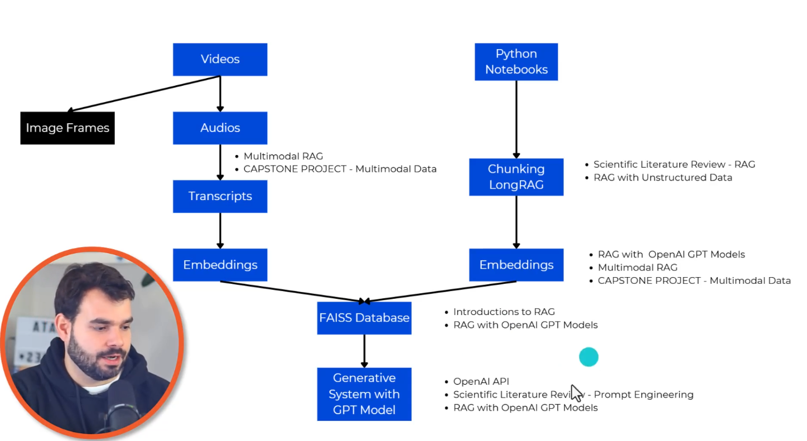
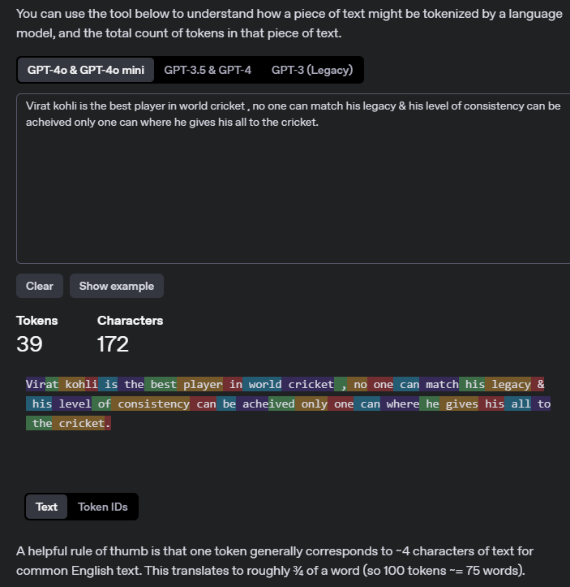

# AI Engineering Bootcamp: RAG (Retrieval Augmented Generation) for LLMs

Your notes are not a performance; they are your personal scaffolding for understanding. The clarity you build within them is your superpower, not a public spectacle. Write for your future self, not for anyone else's judgment.

## Section 1: Introduction to Retrieval Augmented Generation (RAG) Systems

- the course materials store them in my Google Drive(AI Engineering) since I will use Google Colab & after done with the file , i will upload them in this repo.
- Refer offline notes as well.

## SectionTwo: Fundamentals of Retrieval Systems

- Read Offline Notes first.

- `stepOne.ipynb` : Tokenization and pre-processing & `practicalTips`
- **use this command to install libraries in our jupyter notebooks** - `!uv add requests`
- [OpenAI Tokenizer](https://platform.openai.com/tokenizer) & [Gemini Token counting](https://ai.google.dev/gemini-api/docs/tokens?lang=python)
  - `For Gemini models`, a token is equivalent to about 4 characters. 100 tokens is equal to about 60-80 English words.
  - `FOR OPEN_AI models` : A helpful rule of thumb is that one token generally corresponds to ~4 characters of text for common English text. This translates to roughly ¾ of a word (so 100 tokens ~= 75 words).
    
    - `Token IDs :` [60985, 266, 31741, 1307, 382, 290, 1636, 5033, 306, 2375, 57976, 1366, 860, 1001, 665, 3981, 1232, 33304, 827, 1232, 3211, 328, 45250, 665, 413, 27427, 3276, 1606, 1001, 665, 1919, 501, 8967, 1232, 722, 316, 290, 57976, 13]
- Depending on the model we use the tokenizer process changes.
